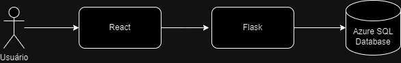
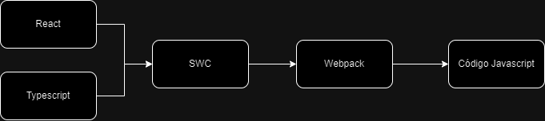
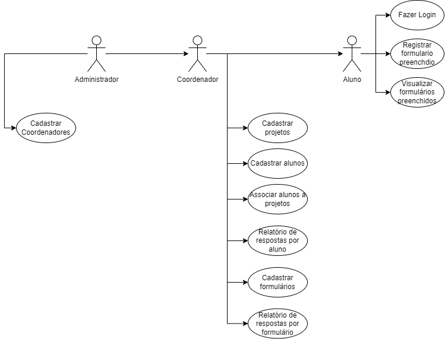

# FreeForm
FreeForm é uma plataforma feita para agilizar os processos de avaliação através de formulários utilizados pela fisioterapia no campus Araranguá da UFSC. Ele consiste em uma ferramenta que permite a criação de fórmularios customizados, similar ao Google Forms, que são armazenados, processados e avaliados dentro da ferramenta para diagnosticos diversos.
Essa plataforma foi feita durante a disciplina de Projeto Integrado e ainda está em WIP (_Work in Progress_).

## Índice
- [Arquitetura](#arquitetura)
- [Features](#features)
- [Quickstart](#quickstart)

## Arquitetura

**Fluxo de Execução**





**Fluxo do Bundler**





A stack usada e sua decisão estão a seguir:

**React**
O react foi escolhido pela facilidade de reutilização de código, principalmente na parte de renderização de fórmularios customizados. Ele facilitou a implementação, extensão e diminui o acoplamento do projeto nessa parte e foi por isso que foi escolhido para essa tarefa. 
Para mais informações em como usar react: [React: Quickstart](https://react.dev/learn "React: Quickstart")

**SWC**
O SWC foi utilizado em vez do babel para transpilação do código jsx já que ele tem suporte nativo para typescript e diminui uma dependência adicional do projeto. Além disso, ele tem um único arquivo de configuração em vez 300 deles. 
Para saber como usar o SWC com o Webpack e o Flask: [Usando o Webpack, Flask e SWC](https://python-webpack-boilerplate.readthedocs.io/en/latest/swc/ "Usando o Webpack, Flask e SWC")

**Webpack**
Devido a experiência da equipe com a ferramenta e a necessidade de integrar o front com o back-end em flask ele foi escolhido. Além disso, ele removeu completamente a necessidade de usar um outro server como o next.js para fazer o serviço que um bundler qualquer faria. Ele possuí algumas coisas muito interessantes como uma pipeline de execução muito customizavel, ainda que pouco amigavel, e tem infinitos plugins. 
Para mais informações em como usar o Flask com o Webpack: [Flask e Webpack: Tutorial, a Origem](https://python-webpack-boilerplate.readthedocs.io/en/latest/setup_with_flask/ "Flask e Webpack: Tutorial, a Origem")

**Flask**
O Flask foi escolhido por sua simplicidade e flexibilidade para criar APIs e integrar o front-end ao back-end. Ele permite uma integração fluida com o Webpack, sendo ideal para este projeto devido ao seu suporte a aplicações modulares. Além disso, foi selecionado por ser o framework de back-end com o qual a equipe tem mais experiência.

Documentação: [Documentação da API](https://app.swaggerhub.com/apis-docs/IANDRIANI07/API_PI/1.0.0)

Para mais informações: https://flask.palletsprojects.com/en/stable/

**Azure SQL Database**
O Azure SQL Database foi utilizado como banco de dados pela sua escalabilidade e segurança. Ele permite o armazenamento seguro de informações, garantindo alta disponibilidade para o sistema. Além disso, sua acessibilidade facilita o trabalho dos desenvolvedores e proporciona uma experiência confiável para os usuários.

Para mais informações: https://azure.microsoft.com/pt-br/products/azure-sql/database/

## Features
As features principais são:
- Criação de Fórmularios
- Associação de Fórmularios com formulas
- Hierarquia vertical (administradores, coordenadores, alunos)
- Organização automatizada de dados (nunca mais se preocupe em fumar seus resultados)





O sistema é divido em 3 tipos de úsuarios, os administradores, coordenadores de projetos e alunos. Com as respectivas funcionalidade associadas no diagrama.
Um coodenador é capaz de criar um fórmulario no estilo do Google Forms que, então, será usado como um modelo para preenchimento posterior durante a consulta do aluno com um paciente. 
Dados as informações preenchidas métricas a partir das fórmulas criadas durante o preenchimento do fórmulario são executadas a partir de um script local ([Processador](https://github.com/ianandriani07/Projeto-Integrador/blob/main/static/src/js/processor.ts "Processador de fórmulas")) e enviadas para o backend onde os resultados do fórmulario e das fórmulas é armazenado.
Esses resultados ficam disponíveis a partir do hub onde o coordenador consegue visualizar todos os dados preenchidos até agora pelos alunos, para analises diversas.

**Obs:** Nosso sistema não armazena nomes por razões de segurança, todas as entradas de respostas são salvas a partir de identificadores números. Ainda assim, caso o úsuario queria é possível criar um campo "Nome" nos fórmularios e, portanto, qualquer armazenamento de informações sensíveis é de cunho do usuário e nós, os desenvolvedores, não nos responsabilizamos pelo armazenamento indevido de informações que violem qualquer lei.

## Quickstart
### Como iniciar o projeto na primeira vez
```bash
docker-compose up --build
```

### Após o projeto já ser iniciado pela primeira vez

* Após o projeto já ter sido iniciado, você pode executa-lo novamente utilizando
```bash
docker-compose up
```
* Para parar a execução do projeto basta utilizar
```bash
docker-compose down
```

### Quando utilizar 'docker-compose up --build' após o projeto já ter sido iniciado
* **Modificações no Dockerfile**: Sempre que você alterar o Dockerfile (como adicionar novos pacotes, mudar as etapas de construção ou fazer qualquer outra alteração), será necessário reconstruir os contêineres para que as mudanças tenham efeito
* **Alterações nas dependências**: Se você fizer mudanças nos arquivos que definem dependências, como o **requirements.txt** para o Flask ou o **package.json** para o Webpack, precisará reconstruir os contêineres para instalar as novas dependências.
* **Mudanças na configuração do docker-compose.yml**: Se você modificar o arquivo **docker-compose.yml**, como mudar as portas, volumes, ou variáveis de ambiente, você deve usar **--build** para garantir que os contêineres sejam atualizados com as novas configurações.

### Quando utilizar 'docker-compose up'
* **Alterações no código da aplicação**: Se você alterar apenas o código da aplicação (como arquivos **.py** para o Flask ou **.js/.scss** para o Webpack), e não fez mudanças no Dockerfile ou nas dependências, você pode rodar apenas **docker-compose up**. Como você configurou volumes no **docker-compose.yml**, essas mudanças no código serão refletidas automaticamente dentro do contêiner sem precisar reconstruí-lo.
